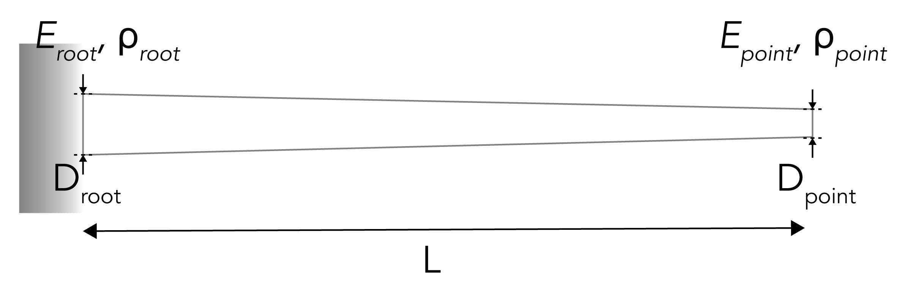

 <h1 align="center">Functionally Graded Whisker Finite Element Simulation</h1>

<p align="center">
  <a href="https://is.mpg.de/person/lsmith"><strong>Lawrence T. Smith*</strong></a> ·
  <a href="https://hi.is.mpg.de/person/aschulz"><strong>Andrew K. Schulz*</strong></a>
</p>

<p align="center"><strong>*</strong> denotes equal contributions to this repository.</p>
<p align="center">
  <a href="https://arxiv.org/abs/2504.07143">
    
	  <a href="https://doi.org/10.17617/3.ROQPWZ">
    
  </a>
</p>

  

<p align="center">
  
</p>

<p align="center">
  This repository contains a workflow for simulating various whisker dynamics and statics as described in the paper.
  For related data (e.g., indentation, SEM, microCT), please refer to the 
  <a href="https://doi.org/10.17617/3.ROQPWZ">Edmond data repository</a>.
</p>

## General Information

This repository demonstrates a streamlined workflow for analyzing **functionally graded whiskers** under various loading scenarios using the nonlinear finite element platform **Abaqus**, with minimal manual intervention.

Running any script in this directory initiates a fully automated pipeline that:
- Sets up simulations programmatically in **MATLAB** (including meshing, material properties, and boundary conditions),
- Executes simulations via command-line calls to Abaqus,
- Processes simulation output, and
- Generates publication-ready figures from the results.

These tools reproduce results from the associated paper or enable analysis of related problems. For academic use, the **[Abaqus Learning Edition](https://www.3ds.com/edu/education/students/solutions/abaqus-le)** (free, node-limited) is a suitable alternative to the full commercial license, as long as mesh sizes remain small. Full implementation details are provided in the main paper's **[Supplemental Methods](https://arxiv.org/abs/2504.07143)**.

---

## Features

1. Modal mesh convergence studies for functionally graded beams  
2. Construction of finite element models based on whisker geometry, porosity, and stiffness  
3. Static finite element simulation with controlled tip displacement  
4. Static finite element simulation with controlled tip force  
5. Dynamic finite element simulation to determine natural frequencies  
6. Dynamic response simulation of whiskers following a pluck  
7. Automated data visualization for all simulation outputs  


## Getting Started

This project is developed using [PlatformIO](https://platformio.org/). To get started:

1. Follow the dependency links below to download the required additional programs.

   | Dependency         | Version               | Purpose                                                                 | Link                                                                                   |
   |--------------------|------------------------|-------------------------------------------------------------------------|----------------------------------------------------------------------------------------|
   | MATLAB             | 2023A                  | For command line prompt and visualization                              | [MathWorks Install Guide](https://www.mathworks.com/help/install/ug/install-products-with-internet-connection.html) |
   | Abaqus             | Learning Edition       | For FE simulation; learning edition supports up to 1000 nodes          | [Abaqus Student Edition](https://www.3ds.com/edu/education/students/solutions/abaqus-le) |
   | Abaqus2Matlab      | 1.03                   | For connecting MATLAB and Abaqus                                       | [Abaqus2Matlab](https://abaqus2matlab.wixsite.com/abaqus2matlab)                      |
   | GibbonCode         | 3.5.0                  | For visualization and mesh generation                                  | [GIBBON Installation](https://www.gibboncode.org/Installation/)                       |
   | nodewiseProcesses  | 1.0                    | For data post-processing                                               | [nodewiseProcesses GitHub](https://github.com/LawSmith408/nodewiseProcesses)          |

2. Download this repo and open it in MATLAB.

4. You can run the script using `run_modal_analysis.m`.
5. Download the files from the [nodewiseProcess GitHub page](https://github.com/LawSmith408/nodewiseProcesses) including `interpDisp.m` and `stack3D.m` and copy them into the `dep/` folder from this repository.
6. Read the simulation assumptions and customization notes below and the variables that can be altered
7. Run the specific simulations required. 
8. Run visualizations of the simulations.

## Simulation Assumptions and Boundary Conditions
For all simulations, a few assumptions are made. This includes:
1. Porosity gradients from the root to the point are assumed to be linear
2. Stiffness gradients from the root to the point are assumed to be linear
3. The root has a boundary condition of fixed for all simulations 
For specific simulations, there are different boundary conditions for the point which can be found here:

| Simulation Name                             | Point BC | Output |
|---------------------------------------------|----------|--------|
| Whisker Length                              |force in the y direction at the point (x=L) | du(x)/dx     |
| Diameter at Root                            |displacement in the y direction at the point (x=L) | stress at the root (x=0) |
| Diameter at Point                           |displacement in the y direction along the shaft (x=a) | moment and velocity at the root |


## Variables for Simulation
The variables that are customizable for the bio-inspired beam are the following: 

<p align="center">
  
</p>

The following table summarizes the main adjustable parameters for the whisker-inspired beam. These include geometry, material stiffness, porosity, and loading conditions. Note that individual MATLAB scripts may also define additional boundary conditions.

| Variable Description                         | Variable Name         | Units   |
|---------------------------------------------|------------------------|---------|
| Whisker length                               | `W.Length`             | mm      |
| Diameter at base                             | `W.D_base`             | μm      |
| Diameter at tip                              | `W.D_tip`              | μm      |
| Modulus at base                              | `W.E_base`             | MPa     |
| Modulus at tip                               | `W.E_tip`              | MPa     |
| Porosity at base                            | `Porosity_base`        | %       |
| Porosity at tip                               | `Porosity_Tip`         | %       |
| Applied Transverse load at tip               | `W.appliedMoment`      | N       |
| Prescribed transverse displacement at tip    | `W.prescribedDisp`     | mm      |


## Support 

Please note that this codebase doesn't come with direct support, but feel free to contact us.
    
## Contributing 

Please feel free to contribute improvements or report issues.

## Note: 

If you encounter any problems or questions about specific parts of the codebase, don't hesitate to raise an issue. Always provide as much context as possible.

```bibtex
@misc{smith_functionally_2025,
	address = {whisker analyses},
	title = {Functionally Graded Whisker Finite Element Simulation},
	author = {Smith, Lawrence and Schulz, Andrew K.},
	howpublished = {Submitted},
	year = {2025},
}

```
## License
See the LICENSE file for more information. 

## Acknowledgements
The authors thank the International Max Planck Research School for Intelligent Systems, [IMPRS-IS](https://imprs.is.mpg.de/) for supporting LTS and AKS. We thank J. Burns for his assistance in preparing the content for this GitHub. The authors thank N. Rokhmanova for her [ARIADNE repo](https://github.com/nrokh/ARIADNE) inspiring this ReadMe. Thanks to [Katherine J. Kuchenbecker](https://is.mpg.de/~kjk) for support and feedback.

## Contact 

This code repository was implemented by [Lawrence T. Smith](https://github.com/LawSmith408) and [Andrew Schulz](https://github.com/Aschulz94). 

Give a ⭐ if you like.
