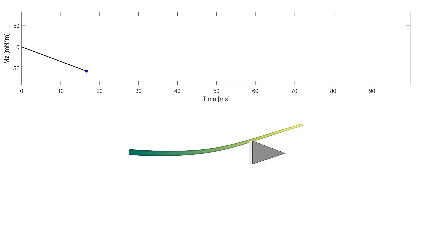

# Functionally Graded Whisker Finite Element Simulation

 <h1 align="center">Whisker Simulation Workflow</h1>

<p align="center">
  <a href="https://is.mpg.de/person/lsmith"><strong>Lawrence T. Smith*</strong></a> ·
  <a href="https://hi.is.mpg.de/person/aschulz"><strong>Andrew K. Schulz*</strong></a>
</p>

<p align="center"><strong>*</strong> denotes equal contributions to this repository.</p>

<p align="center">
  
</p>

<p align="center">
  This repository contains a workflow for simulating various whisker dynamics and statics as described in the paper.
  For related data (e.g., indentation, SEM, microCT), please refer to the 
  <a href="https://doi.org/10.17617/3.ROQPWZ">Edmond data repository</a>.
</p>

## General information

The files in this directory demonstrate how to analyze functionally graded whiskers in various loading scenarios using the nonlinear finite element platforms Abaqus using a streamlined workflow with minimal manual intervention. Running one of the scripts in this folder will trigger a series of automated processes that allow users to reproduce the results presented in this paper, or to analyze similar problems on their own. For academic work, the free but node-limited Abaqus Learning Edition is a viable replacement for a full Abaqus license, provided that mesh sizes are kept small. A full description of these processes is included in Supplemental Information.

Simulation setup (meshing, material property assignment, boundary condition application, etc.) is performed programmatically in MATLAB. Simulations are executed automatically at the command line using MATLAB functions, and upon completion results are retrieved and processed. Finally, figures are generated from the processed data and prepared for export using MATLAB.

## Features 

1. Modal mesh convergence study for functional gradient beams
2. Construction of finite element methods for beams inspired by whisker geometry, porosity, and stiffness
3. Static FE simulation for controlled tip displacement
4. Static FE simulation for controlled tip force
5. Dynamic FE simulation for natural frequency
6. Dynamic FE simulation for frequency after the beam is plucked. 
7. Data visualizations of all of the above. 

## Required Dependencies for getting started. 

## Workflow Dependencies

| Dependency         | Version               | Purpose                                                                 | Link                                                                                   |
|--------------------|------------------------|-------------------------------------------------------------------------|----------------------------------------------------------------------------------------|
| MATLAB             | 2023A                  | For command line prompt and visualization                              | [MathWorks Install Guide](https://www.mathworks.com/help/install/ug/install-products-with-internet-connection.html) |
| Abaqus             | Learning Edition       | For FE simulation; learning edition supports up to 1000 nodes          | [Abaqus Student Edition](https://www.3ds.com/edu/education/students/solutions/abaqus-le) |
| Abaqus2Matlab      | 1.03                   | For connecting MATLAB and Abaqus                                       | [Abaqus2Matlab](https://abaqus2matlab.wixsite.com/abaqus2matlab)                      |
| GibbonCode         | 3.5.0                  | For visualization and mesh generation                                  | [GIBBON Installation](https://www.gibboncode.org/Installation/)                       |
| nodewiseProcesses  | 1.0                    | For data post-processing                                               | [nodewiseProcesses GitHub](https://github.com/LawSmith408/nodewiseProcesses)          |


## Getting Started

This project is developed using PlatformIO. To get started:

1. Follow the dependency links above to download the required additional programs. 
2. Download this Repo and open it in MATLAB.
3. Download the files from the nodewiseProcess GitHub page including 'interpDisp.m' and 'stack3D.m' and copy them into the 'dep' folder from this repository.
4. Read the simulation assumptions and customization notes below and the variables that can be altered
5. Run the specific simulations required. 
6. Run visualizations of the simulations. 

## Simulation Assumptions and Boundary Conditions
For all simulations, a few assumptions are made. This includes:
1. Porosity gradients from the root to the point are assumed to be linear
2. Stiffness gradients from the root to the point are assumed to be linear
3. The root has a boundary condition of fixed for all simulations 
For specific simulations, there are different boundary conditions for the point which can be found here:

| Simulation Name                             | Point BC | Output |
|---------------------------------------------|----------|--------|
| Whisker Length                              |force in the y direction at the point (x=L) | du(x)/dx     |
| Diameter at Root                            |displacement in the y direction at the point (x=L) | stress at the root (x=0) |
| Diameter at Point                           |displacement in the y direction along the shaft (x=a) | moment and velocity at the root |


## Variables for Simulation
The variables that are customizable for the bio-inspired beam are the following: 
<p>
  <p align="center"> 
  
</p>

| Variable                                    | Variable Name | Units  |
|---------------------------------------------|---------------|--------|
| Whisker Length                              |W.Length| mm     |
| Diameter at Root                            |W.D_root| $\mu$m |
| Diameter at Point                           |W.D_tip| $\mu$m |
| Modulus at Root                             |W.E_root| MPa    |
| Modulus at Point                            |W.E_tip| MPa    |
| Porosity at Root                            |Porosity_Root| \%     |
| Porosity at Point                           |Porosity_Tip | \%     |
| Applied Transverse Load at Point            |W.appliedMoment| N      |
| Prescribed Transverse Displacement at Point |W.prescribedDisp| mm     |

Note that for these are just the basic geometry, stiffness, and porosity values each MATLAB file has specific values for boundary conditions as well. 

## Support 

Please note that this codebase doesn't come with direct support, but feel free to contact us.
    
## Contributing 

Please feel free to contribute improvements or report issues.

## Note: 

If you encounter any problems or questions about specific parts of the codebase, don't hesitate to raise an issue. Always provide as much context as possible.

```bibtex
@misc{smith_functionally_2025,
	address = {whisker analyses},
	title = {Functionally Graded Whisker Finite Element Simulation},
	author = {Smith, Lawrence and Schulz, Andrew K.},
	howpublished = {Submitted},
	year = {2025},
}

```
## License
See the LICENSE file for more information. 

## Acknowledgements
The authors thank the International Max Planck Research School for Intelligent Systems, [IMPRS-IS](https://imprs.is.mpg.de/) for supporting LTS and AKS. We thank J. Burns for his assistance in preparing the content for this GitHub. The authors thank N. Rokhmanova for her [ARIADNE repo](https://github.com/nrokh/ARIADNE) inspiring this ReadMe. Thanks to [Katherine J. Kuchenbecker](https://is.mpg.de/~kjk) for support and feedback.

## Contact 

This code repository was implemented by [Lawrence T. Smith](https://github.com/LawSmith408) and [Andrew Schulz](https://github.com/Aschulz94). 

Give a ⭐ if you like.
