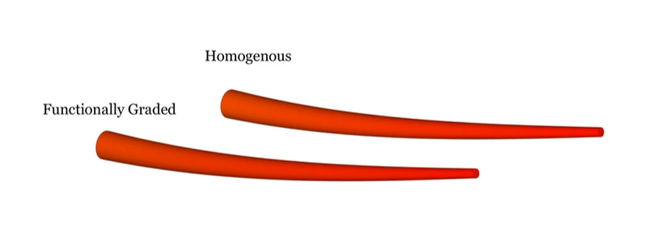

# Functionally Graded Whisker Finite Element Simulation

  </h1>
  <p align="center">
    <a href="https://is.mpg.de/person/lsmith"><strong>Lawrence T. Smith*</strong></a>
    ·
    <a href="https://hi.is.mpg.de/person/aschulz"><strong>Andrew K. Schulz*</strong></a>
    ·
</p>
<p>
  <p align="center"> 
  
</p>
This is a workflow that will allow simulation of various whiskers including static and dynamic whisker simulations as described in the paper. For information on the raw data of indentation, SEM information, microCT, please refer to the Edmond data repository https://doi.org/10.17617/3.ROQPWZ. 
</p>

## General information

The files in this directory demonstrate how to analyze functionally graded whiskers in various loading scenarios using the nonlinear finite element platforms Abaqus using a streamlined workflow with minimal manual intervention. Running one of the scripts in this folder will trigger a series of automated processes that allow users to reproduce the results presented in this paper, or to analyze similar problems on their own. For academic work, the free but node-limited Abaqus Learning Edition is a viable replacement for a full Abaqus license, provided that mesh sizes are kept small. A full description of these processes is included in Supplemental Information.

Simulation setup (meshing, material property assignment, boundary condition application, etc.) is performed programmatically in MATLAB. Simulations are executed automatically at the command line using MATLAB functions, and upon completion results are retrieved and processed. Finally, figures are generated from the processed data and prepared for export using MATLAB.

## Features 

1. Construction of finite element methods for beams inspired by whisker geometry, porosity, and stiffness
2. Static FE simulation for controlled tip displacement
3. Static FE simulation for controlled tip force
4. Dynamic FE simulation for natural frequency
5. Dynamic FE simulation for frequency after the beam is plucked. 
6. Data visualizations of all of the above. 

## Required Dependencies for getting started. 

This workflow has the following dependencies:

| Dependency | Version (if applicable)|  Purpose | Link |
|-------------|-------------------|---------|------------|
| MATLAB | 2023A | For command line prompt and visualization | https://www.mathworks.com/help/install/ug/install-products-with-internet-connection.html | 
| Abaqus | Abaqus Learning Edition | For FE simulating, the learning edition allows 1000 nodes, which is able to run all of the included code | https://www.3ds.com/edu/education/students/solutions/abaqus-le |
| Abaqus2Matlab | XX | For connecting MATLAB and Abaqus | https://abaqus2matlab.wixsite.com/abaqus2matlab | 
| GibbonCode | XX | For XX | https://www.gibboncode.org/Installation/ | 
| nodewiseProcesses | XX | For XX | https://github.com/LawSmith408/nodewiseProcesses | 

## Getting Started

This project is developed using PlatformIO. To get started:

1. Follow the dependency links above to download the required additional programs. 
2. Download this Repo and open it in MATLAB.
3. Download the files from the nodewiseProcess GitHub page including 'interpDisp.m' and 'stack3D.m' and copy them into the 'dep' folder from this repository.
4. Read the simulation assumptions and customization notes below and the variables that can be altered
5. Run the specific simulations required. 
6. Run visualizations of the simulations. 

## Simulation Assumptions and Boundary Conditions
For all simulations, a few assumptions are made. This includes:
1. Porosity gradients from the root to the point are assumed to be linear
2. Stiffness gradients from the root to the point are assumed to be linear
3. The root has a boundary condition of a XX
For specific simulations, there are different boundary conditions for the point which can be found here:

| Simulation Name                             | Point BC | Output |
|---------------------------------------------|----------|--------|
| Whisker Length                              |a| mm     |
| Diameter at Root                            |a| $\mu$m |
| Diameter at Point                           |a| $\mu$m |
| Modulus at Root                             |a| MPa    |
| Modulus at Point                            |a| MPa    |

## Variables for Simulation
The variables that are customizable for the bio-inspired beam are the following: 
| Variable                                    | Variable Name | Units  |
|---------------------------------------------|---------------|--------|
| Whisker Length                              |a| mm     |
| Diameter at Root                            |a| $\mu$m |
| Diameter at Point                           |a| $\mu$m |
| Modulus at Root                             |a| MPa    |
| Modulus at Point                            |a| MPa    |
| Porosity at Root                            |a| \%     |
| Porosity at Point                           |a| \%     |
| Applied Transverse Load at Point            |a| N      |
| Prescribed Transverse Displacement at Point |a| mm     |

Note that for the functional gradient simulation in this code a

### Starting up the simulation 
Upon inputting each of these parameters XX.

## Support 

Please note that this codebase doesn't come with direct support, but feel free to contact us.

## License

Please refer to the LICENSE file included with this project for information about the license.
    
## Contributing 

Please feel free to contribute improvements or report issues.

## Note: 

If you encounter any problems or questions about specific parts of the codebase, don't hesitate to raise an issue. Always provide as much context as possible.

## Citation

Schulz, Andrew Kyle; Kaufmann, Lena Valentina; Smith, Lawrence; Philip, Deepti; David, Hilda; Lazovic Zinnanti, Jelena; Brecht, Michael; Richter, Gunther; Kuchenbecker, Katherine J., 2024, "Data for: Functionally graded keratin facilitates tactile sensing in elephant whiskers", https://doi.org/10.17617/3.ROQPWZ

```bibtex
@misc{schulz_functionally_2024,
	address = {Scientific Figures},
	title = {Functionally graded keratin facilitates tactile sensing in elephant whiskers},
	author = {Rokhmanova, Nataliya and Schulz, Andrew K.},
	howpublished = {Submitted},
	year = {2024},
}

```
## License
See the LICENSE file for more information. 

## Acknowledgements
The authors thank the International Max Planck Research School for Intelligent Systems, [IMPRS-IS](https://imprs.is.mpg.de/) for supporting LTS and AKS. We thank J. Burns for his assistance in preparing the content for this GitHub. The authors thank N. Rokhmanova for her [ARIADNE repo](https://github.com/nrokh/ARIADNE) inspiring this ReadMe. Thanks to [Katherine J. Kuchenbecker](https://is.mpg.de/~kjk) for support and feedback.

## Contact 

This code repository was implemented by [Lawrence T. Smith](https://github.com/LawSmith408) and [Andrew Schulz](https://github.com/Aschulz94). 

Give a ⭐ if you like.
