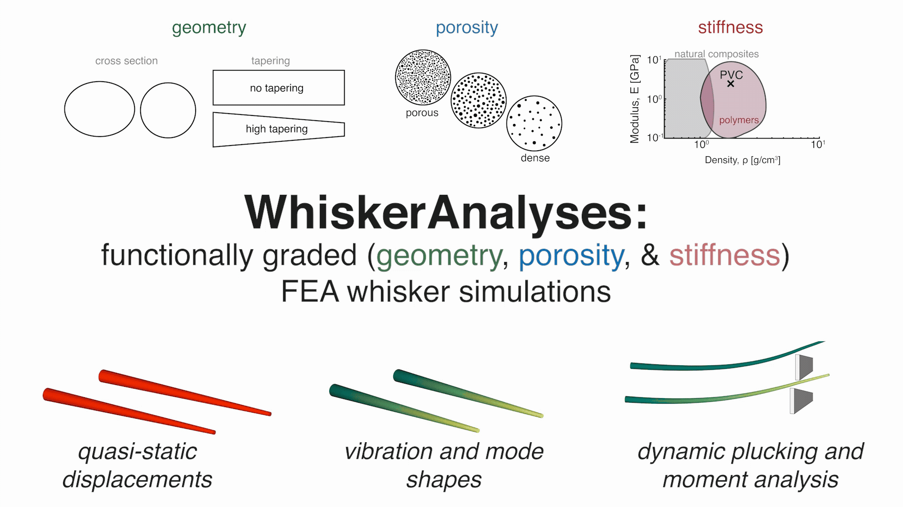
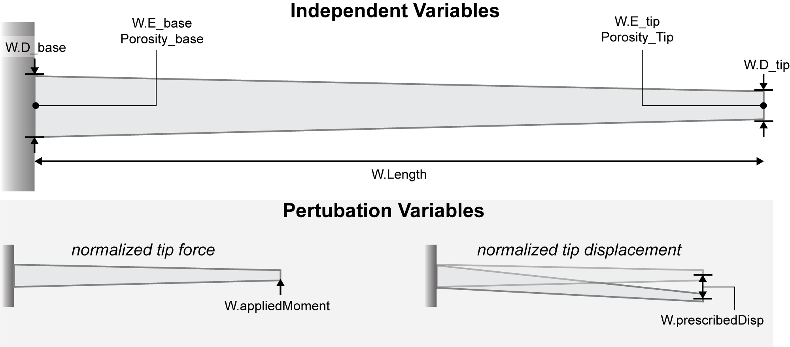

 <h1 align="center">WhiskerAnalyses: Functionally Graded Whisker Simulations</h1>

<p align="center">
  <a href="https://is.mpg.de/person/lsmith"><strong>Lawrence T. Smith</strong></a> ·
  <a href="https://hi.is.mpg.de/person/aschulz"><strong>Andrew K. Schulz</strong></a>
</p>

<p align="center">
  <a href="https://www.science.org/doi/10.1126/science.adx8981">
    
	  <a href="https://doi.org/10.17617/3.ROQPWZ">
    
  </a>
</p>
 
 <p align="center">
  
</p>


<p align="center">
  
</p>

## General Information
This repository contains a workflow for simulating various whisker dynamics and statics as described in the [paper](https://www.science.org/doi/10.1126/science.adx8981). For related data (e.g., indentation, SEM, microCT), please refer to the <a href="https://doi.org/10.17617/3.ROQPWZ">Edmond data repository</a> (repository will be available upon paper acceptance). This repository demonstrates a streamlined workflow for analyzing **functionally graded whiskers** under various loading scenarios using the nonlinear finite element platform **Abaqus**, with minimal manual intervention. 

💡 Tip: You can switch between [Light and Dark mode](https://github.com/settings/appearance) in your GitHub profile settings for better readability. This repo is designed to be viewed in Light mode.

Running any script in this directory initiates a fully automated pipeline that:
- Sets up simulations programmatically in **MATLAB** (including meshing, material properties, and boundary conditions),
- Executes simulations via command-line calls to Abaqus,
- Processes simulation output, and
- Generates publication-ready figures from the results.

These tools reproduce results from the associated paper or enable analysis of related problems. For academic use, the **[Abaqus Learning Edition](https://www.3ds.com/edu/education/students/solutions/abaqus-le)** (free, node-limited) is a suitable alternative to the full commercial license, as long as mesh sizes remain small. Full implementation details are provided in the main paper's **[Supplemental Methods](https://www.science.org/doi/10.1126/science.adx8981)**.

---

## Features

1. Modal mesh convergence studies for functionally graded beams  
2. Construction of finite element models based on whisker geometry, porosity, and stiffness  
3. Static finite element simulation with controlled tip displacement  
4. Static finite element simulation with controlled tip force  
5. Dynamic finite element simulation to determine natural frequencies  
6. Dynamic response simulation of whiskers following a pluck  
7. Automated data visualization for all simulation outputs  

## Getting Started

This project is developed using [PlatformIO](https://platformio.org/). To get started:

1. Follow the dependency links below to download the required additional programs.

   | Dependency         | Version               | Purpose                                                                 | Link                                                                                   |
   |--------------------|------------------------|-------------------------------------------------------------------------|----------------------------------------------------------------------------------------|
   | MATLAB             | 2023A                  | For command line prompt and visualization                              | [MathWorks Install Guide](https://www.mathworks.com/help/install/ug/install-products-with-internet-connection.html) |
   | Abaqus             | Learning Edition       | For FE simulation; learning edition supports up to 1000 nodes          | [Abaqus Student Edition](https://www.3ds.com/edu/education/students/solutions/abaqus-le) |
   | Abaqus2Matlab      | 1.03                   | For connecting MATLAB and Abaqus                                       | [Abaqus2Matlab](https://abaqus2matlab.wixsite.com/abaqus2matlab)                      |
   | GibbonCode         | 3.5.0                  | For visualization and mesh generation                                  | [GIBBON Installation](https://www.gibboncode.org/Installation/)                       |
   | nodewiseProcesses  | 1.0                    | For data post-processing                                               | [nodewiseProcesses GitHub](https://github.com/LawSmith408/nodewiseProcesses)          |
   | ColorBrewer        | 3.2.8                  | For attractive and distinctive colormaps                               | [ColorBrewer](https://github.com/DrosteEffect/BrewerMap)          |

2. Download this ([Download as ZIP](https://github.com/LawSmith408/WhiskerAnalyses/archive/refs/heads/main.zip)) repo and open it in MATLAB. Or clone it using Git:
```bash
git clone https://github.com/LawSmith408/WhiskerAnalyses.git
```

4. You can run the script in the MATLAB command line using:
```bash
MeshConvergenceStudy_Modal.m
```
5. Download the files from the [nodewiseProcess GitHub page](https://github.com/LawSmith408/nodewiseProcesses) including `interpDisp.m` and `stack3D.m`.
6. Ensure that all dependencies are visible to your MATLAB instance by using "Set Path -> Add to Path with Subfolders."
7. Understand the assumptions of this simulation, boundary conditions, and variables that can be shifted ([described in the next section](https://github.com/LawSmith408/WhiskerAnalyses/blob/main/README.md#simulation-assumptions-and-boundary-conditions)). The primary variables that can be shifted in these simulations are: $${\color{green}\text{geometry}}$$, $${\color{blue}\text{porosity}}$$, and $${\color{red}\text{stiffness}}$$.
8. Run the specific simulations required.

## Simulation Assumptions, Boundary Conditions, Independent Variables

For all simulations, a few assumptions are made.

<details>
	
### Variable Assumptions

The following gradients are treated as linearly distributed variables from base (root) to tip:

1. **Symmetric Geometry**: The beam is assumed to be transversely symmetric, meaning the cross-section has the same moment of inertia about both principal axes ($I_x = I_y$).
2. **Geometry Gradient**: The diameter tapers linearly from the base to the tip.
3. **Porosity Gradient**: Porosity changes linearly from the base to the tip and may increase or decrease depending on input.
4. **Stiffness Gradient**: Young’s modulus varies linearly along the length of the beam, with customizable direction of the gradient.

### Independent Variables in the simulation
The following table summarizes the main adjustable parameters for the whisker-inspired beam. These include geometry, material stiffness, porosity, and loading conditions. Note that individual MATLAB scripts may also define additional boundary conditions. Note you can use either the visual image or the table to see the labels of the whisker simulation. 

 <p align="center">
  
</p>

| Variable Description                         | Variable Name         | Units   |
|---------------------------------------------|------------------------|---------|
| Whisker length                               | `W.Length`             | mm      |
| Diameter at base                             | `W.D_root`             | μm      |
| Diameter at tip                              | `W.D_tip`              | μm      |
| Modulus at base                              | `W.E_root`             | MPa     |
| Modulus at tip                               | `W.E_tip`              | MPa     |
| Porosity at base                            | `Porosity_base`        | %       |
| Porosity at tip                               | `Porosity_Tip`         | %       |
| Applied Transverse load at tip               | `W.appliedMoment`      | N       |
| Prescribed transverse displacement at tip    | `W.prescribedDisp`     | mm      |

### Boundary Condition Assumptions
1. **Base is fixed**: The base has a boundary condition of fixed for all simulations
2. **Tip depends on simulation**: The tip boundary condition has differing boundary conditions that are explained in the simulation sub-heading. 
For specific simulations, there are different boundary conditions for the point which can be found here:

| Simulation File Name | Simulation Description | Tip Boundary Condition | Model Outputs |                         
|---------------------------------------------|----------|----------|--------|
|`W.appliedForce`| Quasi-static applied transverse load at tip viewing tip displacement                             | $$f_y\vert_{x=L}$$ | $$\overrightarrow{u(x)}$$     |
|`W.prescribedDisp`| Quasi-static prescribed transverse displacement at tip                            | $$u_y\vert_{x=L}$$ | $$\sigma_{11}\vert_{x=0}$$     |
|`pluckDist`| Dynamic prescribed transveerse displacement distance $$a$$ from base                            | $$u_y\vert_{x=a}$$ | $$\overrightarrow{u(x,t)}$$ and $$M_z(t)\vert_{x=0}$$   |


</details>


## FEA Validation and Mesh-convergence

This GitHub repository gives a step-by-step tutorials for running simulations on running several non-linear simulations, however with any FEA simulations its critical to first perform a non-linear parametric study and mesh convergence to determine FEA settings and mesh-size.


<details>

### Finite-element validation

For running validation for your simulation, there is a quick study to understand if linear or non-linear methods are necessary: 

1. **Finite-element validation**: Start with a simple beam tip displacement test to determine if the simulation's boundary conditions are satisfied and it behaves as an Eulerian beam under small displacements. 

### FEA mesh-convergence study

For running a mesh convergence for your simulation, we have included a quick script that allows you to run a mesh convergence study, plot the data, and analyze the results. 

1. **Mesh-convergence script**: For the mesh script open the MATLAB command window and run the following: 
```bash
MeshConvergenceStudy_Modal.m
```


</details>

## FEA simulations included in WhiskerAnalyses

Overall in the following sections there are simple (quasi-static), semi-complex (natural vibration modes), and complex (dynamic plucking sims that are possible. Overall the following tasks, figures, and output comparisons are possible: 
1. **[Normalized tip displacement:](https://github.com/LawSmith408/WhiskerAnalyses?tab=readme-ov-file#normalized-tip-displacement)** Quasi-static non-linear finite element model with a controlled tip displacement value allowing comparison between whiskers. 
2. **[Normalized tip force:](https://github.com/LawSmith408/WhiskerAnalyses?tab=readme-ov-file#normalized-tip-force)** Quasi-static non-linear finite element model with a controlled tip force allowing comparison between whiskers
3. **[Density gradient vibration:](https://github.com/LawSmith408/WhiskerAnalyses?tab=readme-ov-file#density-gradient-vibration)** Dynamic vibration analysis displaying density gradient eigenfrequencies and eigenmodes.
4. **[Stiffness gradient vibration:](https://github.com/LawSmith408/WhiskerAnalyses?tab=readme-ov-file#stiffness-gradient-vibration)**  Dynamic vibration analysis displaying stiffness gradient eigenfrequencies and eigenmodes.
5. **[Frequency Analysis:](https://github.com/LawSmith408/WhiskerAnalyses?tab=readme-ov-file#frequency-analysis)** Allow analysis and comparison of frequencies between different whisker conditions. 
6. **[Pluck and release:](https://github.com/LawSmith408/WhiskerAnalyses?tab=readme-ov-file#pluck-and-release)** Allows controlled plucking along the whisker's length to compare frequency content. 


## Support 

Please note that this codebase doesn't come with direct support, but feel free to contact us. Our names and contact information are listed at the bottom of this page. 
    
## Contributing 

Please feel free to contribute improvements or report issues.

## Note: 

If you encounter any problems or questions about specific parts of the codebase, don't hesitate to raise an issue. Always provide as much context as possible.

 > 
> 
```bibtex
@misc{smith_functionally_2025,
	address = {whisker analyses},
	title = {Functionally Graded Whisker Finite Element Simulation},
	author = {Smith, Lawrence and Schulz, Andrew K.},
	howpublished = {Submitted},
	year = {2025},
}

```
## License
This project is licensed under the GNU GPL version 3 - see the [LICENSE](https://github.com/LawSmith408/WhiskerAnalyses/blob/main/LICENSEd) file for details.

## Copyright

© 2025, Max Planck Society 

## Acknowledgements
The authors thank the International Max Planck Research School for Intelligent Systems, [IMPRS-IS](https://imprs.is.mpg.de/) for supporting LTS and AKS. We thank J. Burns and [J.-C. Passy](https://github.com/jcpassy) for his assistance in preparing the content for this GitHub. The authors thank N. Rokhmanova for her [ARIADNE repo](https://github.com/nrokh/ARIADNE) inspiring this ReadMe. Thanks to [Katherine J. Kuchenbecker](https://is.mpg.de/~kjk) for support and feedback.

## Contact 

This code repository was implemented by [Lawrence T. Smith](https://github.com/LawSmith408) and [Andrew Schulz](https://github.com/Aschulz94). 

Give a ⭐ if you like.
